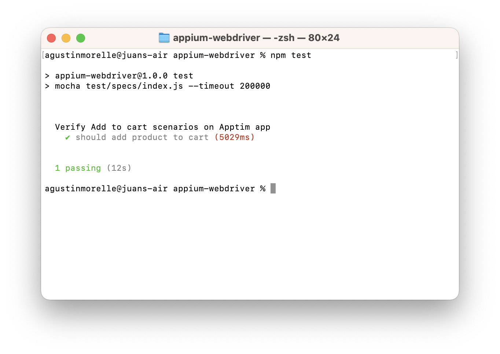

<div align="center">
  <h1>
    <br/>
    📱
    <br />
    <br />
    Appium Webdriver
    <br />
    <br />
  </h1>
  <sup>
    <br />
 Appium Selenium Webdriver Starter Boilerplate for NodeJS with Mocha & AWS Devicefarm insights. Test your mobile apps with ease!</em>
    <br />
    <br />

[](https://github.com/morellexf13/appium-webdriver/actions/workflows/build.yml)
[](https://github.com/morellexf13/appium-webdriver/releases)
[](https://github.com/morellexf13/appium-webdriver/blob/main/LICENSE)
[](https://www.npmjs.com/package/appium-webdriver)
[](https://www.selenium.dev/documentation/overview/)

  </sup>
</div>

<br>

❗️ This guide is mainly intended to be used as an Android User.

## ✨ Pre-requisites

- Install Node (https://nodejs.org/en/download/)
- Install Java (https://www.java.com/en/)
- Setup `ANDROID_HOME` & `JAVA_HOME`
- Install Android Studio (If you want to test using an emulator)

  \*In order to get your app selectors I recommend you to:

- Install Appium Desktop version, it can be found [here](https://github.com/appium/appium-desktop/releases/).

  Make sure that both host & port are configured as you can see in the image bellow.
  

  Why not the terminal version? because this one is easier to configure and you will have a better way to see what is happening while the app is running 😊

- Install Appium Inspector, it can be found [here](https://github.com/appium/appium-inspector/releases).

  1. Open the application you've just installed.
  2. Type `0.0.0.0` in Remote Host.
  3. Type `4723` in Remote Port.
  4. Type '/wd/hub' in Remote Path.
  5. Configure your "Desired Capabilities":
     There are tons of options but you only need this to start.

     ```json
     {
       "platformName": "Android",
       "appium:platformVersion": "12",
       "appium:deviceName": "Android Emulator",
       "appium:app": "{PATH TO APK OR IPA FILE}",
       "appium:automationName": "UiAutomator2" // Default option
     }
     ```

     Read more about desired capabilities [here](https://github.com/appium/appium/blob/master/docs/en/writing-running-appium/caps.md).

     

You're almost done, at this point you just need to run Appium Desktop by clicking the "startServer" button and then go to the Appium Inspector application and click the "Start session" button. Now that your session has started you will see your application at the left and elements TREE at the right. Click an element to see the selectors to use in your tests.
Always try to set accessibility ids! 🫡


<br>

## 🚀 Install & Run boilerplate

Install it locally and run in easy steps

```
1- Start Appium Desktop Server
2- cd appium-webdriver
3- npm install
4- npm test
```



## 📊 Run tests with allure reports

Pre-requisites:

```
brew install allure
```

Generate & Open

```
npm run test-output-allure
```


## 👨🏼‍🎨 Run tests and output JSON

```
npm run test-output-json
```

```json
{
  "stats": {
    "suites": 1,
    "tests": 1,
    "passes": 1,
    "pending": 0,
    "failures": 0,
    "start": "2022-06-24T12:46:05.856Z",
    "end": "2022-06-24T12:46:16.671Z",
    "duration": 10815
  },
  "tests": [
    {
      "title": "should add product to cart",
      "fullTitle": "Verify Add to cart scenarios on Apptim app should add product to cart",
      "file": "/Users/morellexf13/Documents/GitHub/appium-webdriver/nodejswd/test/specs/index.js",
      "duration": 3766,
      "currentRetry": 0,
      "err": {}
    }
  ],
  "pending": [],
  "failures": [],
  "passes": [
    {
      "title": "should add product to cart",
      "fullTitle": "Verify Add to cart scenarios on Apptim app should add product to cart",
      "file": "/Users/morellexf13/Documents/GitHub/appium-webdriver/nodejswd/test/specs/index.js",
      "duration": 3766,
      "currentRetry": 0,
      "err": {}
    }
  ]
}
```

<br>

<div id="create-zipped-test-package">

## 🗳 Create a Zipped Test Package File

```
npm run package
```

</div>

<br>

## 📱 How to setup for Devicefarm

<br>

1- Adapt the test/specs, page objects and apk to your needs.

2- Remember to remove the `capabilities` parameter in `test/base.js`. Custom capabilities will only work for local tests.

```js
driverSetup() {
    return driver.init(capabilities);
  }
```

3- Create a <a href="#create-zipped-test-package">zipped test package</a>. You will need this later 👀.

4- Go to AWS Devicefarm and create a project, use the name you want and go to the next step.


5- Choose the APK file you want to upload and go to the next step.


6- Select the Appium Node.js option.


7- Upload your <a href="#create-zipped-test-package">zipped test package</a> and go to the next step.


❗️This is important, you need to setup the test spec yml file following the example bellow.

```yml
version: 0.1

phases:
  install:
    commands:
      - export NVM_DIR=$HOME/.nvm
      - . $NVM_DIR/nvm.sh
      - nvm install 16.15.1

      - cd $DEVICEFARM_TEST_PACKAGE_PATH
      - npm install *.tgz

      - export APPIUM_VERSION=1.22.2
      - avm $APPIUM_VERSION
      - ln -s /usr/local/avm/versions/$APPIUM_VERSION/node_modules/.bin/appium  /usr/local/avm/versions/$APPIUM_VERSION/node_modules/appium/bin/appium.js

  pre_test:
    commands:
      - echo "Start appium server"
      - >-
        appium --log-timestamp --base-path /wd/hub
        --default-capabilities "{\"deviceName\": \"$DEVICEFARM_DEVICE_NAME\", \"platformName\":\"$DEVICEFARM_DEVICE_PLATFORM_NAME\",
        \"app\":\"$DEVICEFARM_APP_PATH\", \"udid\":\"$DEVICEFARM_DEVICE_UDID\", \"platformVersion\":\"$DEVICEFARM_DEVICE_OS_VERSION\",
        \"chromedriverExecutable\":\"$DEVICEFARM_CHROMEDRIVER_EXECUTABLE\"}"
        >> $DEVICEFARM_LOG_DIR/appiumlog.txt 2>&1 &

      - >-
        start_appium_timeout=0;
        while [ true ];
        do
            if [ $start_appium_timeout -gt 60 ];
            then
                echo "appium server never started in 60 seconds. Exiting";
                exit 1;
            fi;
            grep -i "Appium REST http interface listener started on 0.0.0.0:4723" $DEVICEFARM_LOG_DIR/appiumlog.txt >> /dev/null 2>&1;
            if [ $? -eq 0 ];
            then
                echo "Appium REST http interface listener started on 0.0.0.0:4723";
                break;
            else
                echo "Waiting for appium server to start. Sleeping for 1 second";
                sleep 1;
                start_appium_timeout=$((start_appium_timeout+1));
            fi;
        done;

  test:
    commands:
      - cd $DEVICEFARM_TEST_PACKAGE_PATH/
      - npm install
      - npm test

  post_test:
    commands:

artifacts:
  - $DEVICEFARM_LOG_DIR
```


8- Select a default device pool or create your own and go to the next step, start the session and wait 🤞.


9- Your Devicefarm test has ended successfully! 🌈

